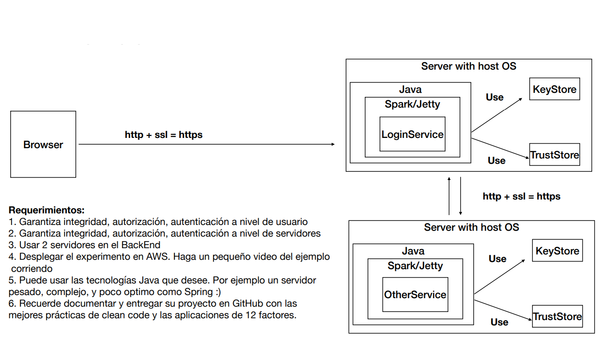

# ALL SECURE APP SPARK AREP 2020-2

## Description

  This is an Apache Spark Web Application that involves three fundamental security components, Authenticity, Authorization and Integrity.
  The main goal of this workshop is to understand how to secure our web apps.
  
## Architecture 

  This is the intended for this project
  
  
 
## User's guide

  This is the guide that will setup this proyect at your local machine in order to be able to run it.
  
  ### Requisites
  
  It is necessary having these tools installed on your computer:
  
  * Maven 
  * Java 
  * Docker
  * Git
  
  ### Setting up this project locally
  
1. **Clone this repository**
  
```sh
  $ git clone https://github.com/JohanS11/LAB7-AREP
```

2. **Open two terminals and go to the root folder of each server and build the project with maven**

```sh
  $ cd LoginApp && mvn package
  $ cd LoginServer && mvn package
```
  
  ### Setting up this project in an EC2 instance
  
1. **Get these images from DockerHub:** 

```sh
  $ docker pull chan1100/loginserver
  $ docker pull chan1100/loginapp  
```

2. **Run the project with Docker (make sure that you have assigned different ports to the dockerhub images):**
  
```sh
  $ docker run -dp <localport>:8000 chan1100/loginserver
  $ docker run -dp <localport>:8000 chan1100/loginapp
```

3. **Test your apps**

```sh
  $ docker ps
  $ docker logs <dockerID/dockername>
```
    
   ### Executing tests
   
   [APPLICATION TESTS VIDEO](https://www.youtube.com/watch?v=6Rk3etqMt5Q)
     
  ## This project was built with:
  
   - Apache Maven 3.6.3 
   - Java 1.8.0_211
   - Git 2.26.2
   - Docker 
   - Apache Spark 
   - Amazon EC2
   
  ## Author
  
  Johan Sebastian Arias Amador ([JohanS11](https://github.com/JohanS11))
  
  ## License
  
  This project is licensed under the GNU General Public License v3.0 - see the [LICENSE](https://github.com/JohanS11/LAB7-AREP/blob/master/LICENSE) file for more details.
